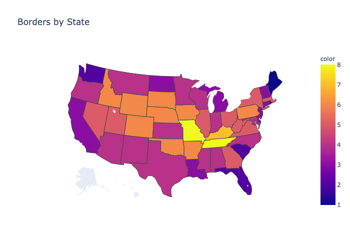
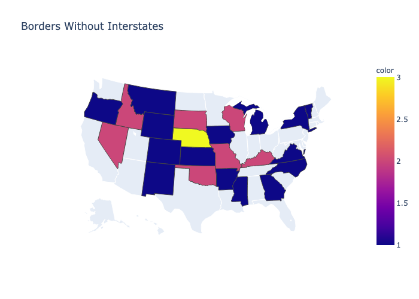
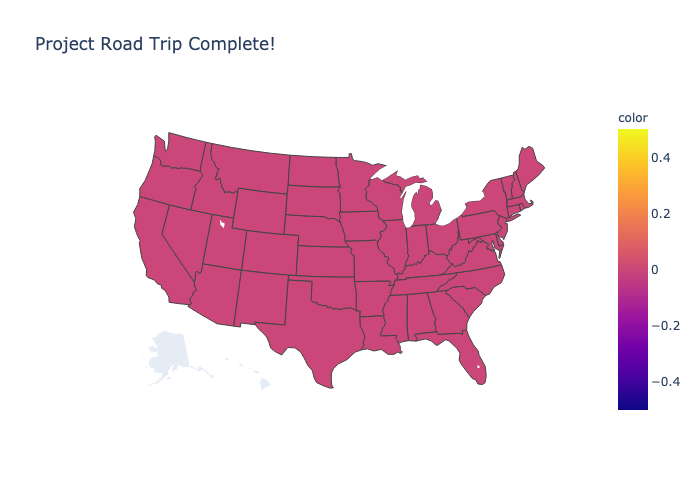

# Project-RoadTrip

This repository concerns my project of crossing every border between two states. Many of the technical details herein detailed have to do with the representation of the contiguous 48 states as a graph, taking the states as nodes and the borders as edges.

For a way of counting state borders XX-YY in terms of the number of bordering states for XX and for YY see [this sheet](https://docs.google.com/spreadsheets/d/1-R4x-0dPx0yoPY_GR57hc6osq9xjJ54054TFljogKDs/edit?usp=sharing).

Here are some relevant maps made with `plotly`:

