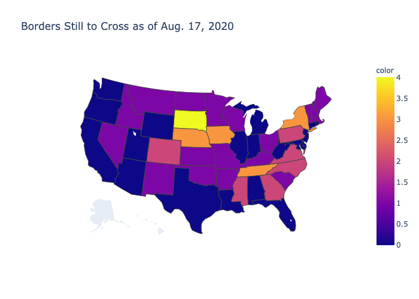

# Project-RoadTrip

This repository concerns my project of crossing every border between two states. The technical details herein detailed have to do with the representation of the contiguous 48 states as a graph, taking the states as nodes and the borders as edges.

Here are some relevant maps made with `plotly`:

